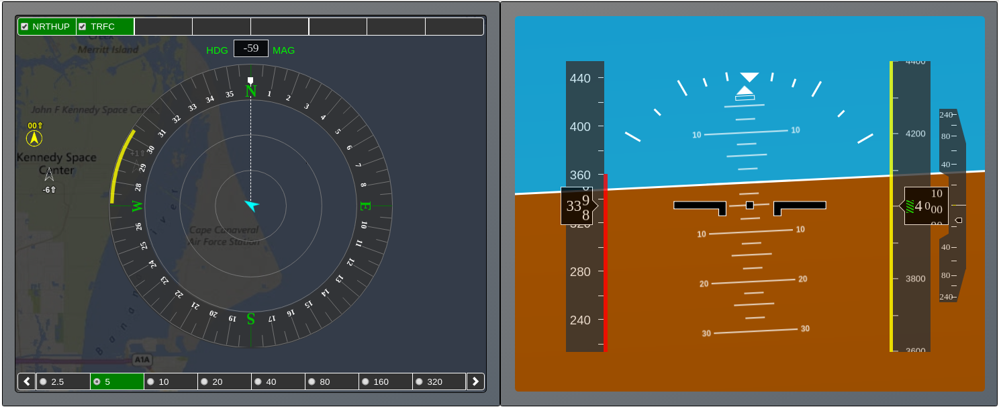

# DAA-Displays: A Toolkit for Rapid Prototyping Interactive Cockpit Displays
DAA-Displays is a toolkit for model-based design and analysis of cockpit
displays. It includes a library of interactive graphical display elements (widgets)
for cockpit systems, and simulations tools supporting comparative analysis of cockpit displays.



## Latest version
daa-displays-1.0.4

## Functionalities
- Library of interactive graphical display elements (called widgets) for cockpit systems: Compass, Interactive Map, Airspeed Tape, Altitude Tape, Vertical Speed, Virtual Horizon 
- Simulation tools supporting comparative analysis of cockpit displays

## Requirements
The following software is necessary to compile and execute DAA-Displays
- NodeJS (https://nodejs.org/en/download)
- Java
- C++

## Installation instructions
1. Download the latest release of DAA-Displays from the github repository.
2. Open a terminal window and change directory to the daadisplays folder.
3. Run `make` in the terminal window.
   This command will create a folder dist/ with the JavaScript distribution.
4. Run the bash script `./restart.sh` in the terminal window.
   The script will download the dependencies and launch the daa-server on port 8082.
5. Open Google Chrome at http://localhost:8082 to render an example interactive prototype developed with DAA-Displays.

## Tips for developers
The `./restart.sh` script supports the following options:
- `-pvsio`               (Enables the pvsio process; pvsio must be in the execution path; requires nasalib)
- `-pvsio <path>`        (Enables the pvsio process; the given pvsio path is used for executing the pvsio environment; requires nasalib)
- `-dev`                 (Enables developer mode; in this mode, caching of simulation results is disabled)
- `-port <port number>`  (The server will use the given port)

## Structure
```
.
├── src
│   ├── daa-displays                     // DAA-Displays widgets library
│   │     ├── daa-airspeed-tape.ts       // Airspeed Tape widget
│   │     ├── daa-altitude-tape.ts       // Altitude Tape widget
│   │     ├── daa-compass.ts             // Compass Display widget
│   │     ├── daa-interactive-map.ts     // Interactive Map widget
│   │     ├── daa-vertical-speed-tape.ts // Vertical Speed Tape widget
│   │     ├── daa-virtual-horizon.ts     // Virtual Horizon widget
│   │     ├── daa-player.ts              // Single-view player
│   │     ├── daa-split-view.ts          // Split-view player
│   │     └── daa-spectrogram.ts         // Spectrogram renderer
│   │
│   ├── daa-config                       // Well-Clear configuration files
│   ├── daa-logic                        // Well-Clear Logic (downloaded from github)
│   ├── daa-output                       // Output files generated by simulation runs
│   ├── daa-scenarios                    // Scenario files for running simulation runs
│   ├── daa-server                       // Server-side component of DAA-Displays
│   │
│   ├── LICENSES                         // NASA Open Source License Agreement
│   ├── index.html                       // Single-view demo app (DaNTi)
│   ├── split.html                       // Split-view demo app
│   └── gods.html                        // Gods-view demo app
│
├── restart.sh                           // Script for starting up the server-side of DAA-Displays
├── Makefile                             // Compilation targets
└── package.json                         // Manifest file

```

## Notices
### Copyright 
Copyright 2019 United States Government as represented by the Administrator of the National Aeronautics and Space Administration. All Rights Reserved.
 
### Disclaimers
**No Warranty**: THE SUBJECT SOFTWARE IS PROVIDED "AS IS" WITHOUT ANY
  WARRANTY OF ANY KIND, EITHER EXPRESSED, IMPLIED, OR STATUTORY,
  INCLUDING, BUT NOT LIMITED TO, ANY WARRANTY THAT THE SUBJECT SOFTWARE
  WILL CONFORM TO SPECIFICATIONS, ANY IMPLIED WARRANTIES OF
  MERCHANTABILITY, FITNESS FOR A PARTICULAR PURPOSE, OR FREEDOM FROM
  INFRINGEMENT, ANY WARRANTY THAT THE SUBJECT SOFTWARE WILL BE ERROR
  FREE, OR ANY WARRANTY THAT DOCUMENTATION, IF PROVIDED, WILL CONFORM TO
  THE SUBJECT SOFTWARE. THIS AGREEMENT DOES NOT, IN ANY MANNER,
  CONSTITUTE AN ENDORSEMENT BY GOVERNMENT AGENCY OR ANY PRIOR RECIPIENT
  OF ANY RESULTS, RESULTING DESIGNS, HARDWARE, SOFTWARE PRODUCTS OR ANY
  OTHER APPLICATIONS RESULTING FROM USE OF THE SUBJECT SOFTWARE.
  FURTHER, GOVERNMENT AGENCY DISCLAIMS ALL WARRANTIES AND LIABILITIES
  REGARDING THIRD-PARTY SOFTWARE, IF PRESENT IN THE ORIGINAL SOFTWARE,
  AND DISTRIBUTES IT "AS IS."
 
**Waiver and Indemnity**: RECIPIENT AGREES TO WAIVE ANY AND ALL CLAIMS
  AGAINST THE UNITED STATES GOVERNMENT, ITS CONTRACTORS AND
  SUBCONTRACTORS, AS WELL AS ANY PRIOR RECIPIENT.  IF RECIPIENT'S USE OF
  THE SUBJECT SOFTWARE RESULTS IN ANY LIABILITIES, DEMANDS, DAMAGES,
  EXPENSES OR LOSSES ARISING FROM SUCH USE, INCLUDING ANY DAMAGES FROM
  PRODUCTS BASED ON, OR RESULTING FROM, RECIPIENT'S USE OF THE SUBJECT
  SOFTWARE, RECIPIENT SHALL INDEMNIFY AND HOLD HARMLESS THE UNITED
  STATES GOVERNMENT, ITS CONTRACTORS AND SUBCONTRACTORS, AS WELL AS ANY
  PRIOR RECIPIENT, TO THE EXTENT PERMITTED BY LAW.  RECIPIENT'S SOLE
  REMEDY FOR ANY SUCH MATTER SHALL BE THE IMMEDIATE, UNILATERAL
  TERMINATION OF THIS AGREEMENT.


## Contacts
* Paolo Masci (NIA) (paolo.masci@nianet.org)
* Cesar Munoz (NASA LaRC) (cesar.a.munoz@nasa.gov)