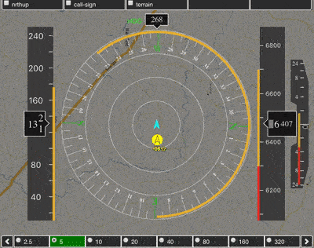
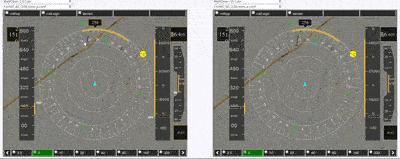
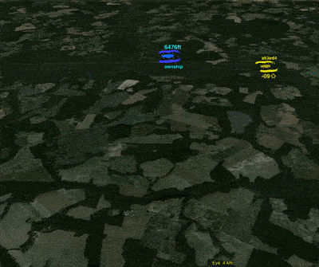
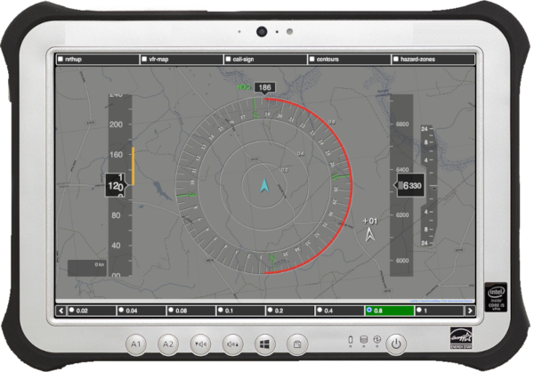

# DAA-Displays: A Toolkit for the Analysis of Detect-And-Avoid Functions in Cockpit Displays
DAA-Displays is a desktop DAA application for model-based design and analysis of detect-and-avoid functions in cockpit
displays. It provides simulations tools designed to support the analysis of cockpit displays, and a library of interactive graphical display elements (widgets) for creating cockpit display prototypes.


## Latest version
daa-displays-1.0.15 (2023.02.23)

## Publications
Paolo Masci and César Muñoz, [A Graphical Toolkit for the Validation of Requirements for Detect and Avoid Systems](https://doi.org/10.1007/978-3-030-50995-8_9), Proceedings of the 14th International Conference on Tests and Proofs (TAP 2020), Lecture Notes in Computer Science, Vol. 12165, pp. 155-166, 2020 [[PDF](https://shemesh.larc.nasa.gov/fm/papers/TAP2020-MM.pdf)][[BibTex](https://shemesh.larc.nasa.gov/fm/papers/TAP2020-MM.bib)]

## Functionalities
- Playback of flight scenarios
- Fast-time simulation of flight scenarios
- Comparative analysis of cockpit displays
- Rendering of DAA alerts and guidance
- Plotting of DAA alerts and guidance over time
- Aural annunciations
- Front-end for quick selection of flight scenarios, DAA configurations
- Library of interactive graphical display elements (called widgets) for cockpit systems: Compass, Interactive Map, Airspeed Tape, Altitude Tape, Vertical Speed, Virtual Horizon 

## Requirements
The following software is necessary to compile and execute DAA-Displays
- NodeJS (v18.0.0 or greater) https://nodejs.org/en/download
- Java Open JDK (1.9 or greater) https://openjdk.java.net/install
- C++ compiler (gcc version 7.4.0 for Linux, Apple clang 11.0.0 for MacOS)
- Google Chrome (80.0.x or greater) https://www.google.com/chrome

## Installation instructions
1. Download the latest release of DAA-Displays from the github repository.
2. Open a terminal window and change directory to the `daa-displays` folder.
3. Run `make` in the terminal window.
   This command will download the dependencies and create a folder `dist/` with the distribution.

## Use instructions
1. Open a terminal in the `daa-displays` folder, and run the bash script `./restart.sh` in the terminal window. The script will launch the daa-server on port 8082. *(Please keep the terminal window open otherwise the execution of the server will be terminated.)*
2. Open Google Chrome at http://localhost:8082
3. Launch one of the DAA Apps (`DANTi`, `single-view`, etc.) by clicking on the corresponding icon.
4. Select a flight scenario, a configuration, and a DAA specification using the drop-down menus provided by the App. Click `Load Selected Scenario and Configuration` to initialize the simulation.
5. Click `Play` to simulate the DAA specification in the selected flight scenario. Use the other simulation controls to jump to specific time instants, change the simulation speed, and generate plot diagrams.

> Note: The `./restart.sh` script supports the following options:
> - `-help`                (Shows the available options)
> - `-pvsio`               (Enables the pvsio process; pvsio must be in the execution path; requires nasalib)
> - `-pvsio <path>`        (Enables the pvsio process; the given pvsio path is used for executing the pvsio environment; requires PVS and NASALib)
> - `-fast`                (Enables optimizations, including caching of simulation results)
> - `-port <port number>`  (The server will use the given port)

## Use Cases
The following examples illustrate concrete applications of the daa-displays toolkit for the analysis of DAA functions in cockpit displays.

### **Example 1**: Demonstration of a DAA algorithm
The rapid prototyping functionalities of the toolkit allow developers to create realistic simulations of cockpit displays suitable to demonstrate DAA specifications and implementations on concrete encounters.
The following example is for the analysis of maneuver guidance provided by a DAA algorithm
to help pilots resolve route conflicts in a flight scenario. 
Maneuver guidance has the form of *bands*, i.e., ranges
of heading, horizontal speed, vertical speed, and altitude maneuvers that
are predicted to be conflict free (the prediction is based on a mathematical 
formula that uses distance and time separation thresholds). Bands are color-coded: 
yellow denotes a corrective maneuver, red denotes a warning maneuver, and green
denotes a recovery maneuver.

The simulation shown in the figure below, illustrate a scenario where a traffic 
aircraft is overtaking the ownship.
Bands on the flight display indicate maneuvers that can be performed to avoid
the conflict. For example, yellow and red bands on the right side of the compass 
indicate that the ownship should avoid right turns.



To reproduce the demonstration shown in the figure:
1. Launch the `DANTi` app (see *Use instructions* above).
2. Select flight scenario `scenario-6` and click `Load Selected Scenario and Configuration`.
3. Click `Play` to watch the behavior of the DAA specification for the selected flight scenario.

### **Example 2**: Comparison of different DAA configurations
Split-view simulations facilitate the comparative analysis of 
two DAA implementations and formal specifications on the same encounter.
In the following example, a newer version of a DAA reference implementation
(on the left-hand side of the split-view) is compared with an older version. 
The newer version introduces additional maneuver guidance in the form of 
speed/heading/altitude bugs rendered on the flight display. 



To reproduce the demonstration shown in the figure:
1. Launch the `split-view` app (see *Use instructions* above).
2. Select flight scenario `s_1_turn_L_wind_0_50`, then select `WellClear-2.0.2.jar` on the left player and `WellClear-1.0.2.jar` in the right player. Click `Load Selected Scenario and Configuration`.
3. Click `Play` to watch the behavior of the two versions in the same flight scenario.

### **Example 3**: 3D Simulation
3D simulations move the focus of the analysis from a cockpit-centric 
view to a scenario-centric view that includes the wider airspace 
around the ownship. The viewport can be adjusted by tilting, 
panning, and zooming the view.  This capability
can be used to gain a better understanding of spatial information 
on the trajectories followed by the ownship and
traffic aircraft in a given scenario. This is useful, e.g., when
assessing DAA algorithms with computer-generated flight scenarios, as
this view provides a tangible idea of what the scenario is about.

The following example 3D simulation is used to examine 
the same flight scenario of Example 1, where a traffic aircraft overtakes the ownship.



To reproduce the demonstration shown in the figure:
1. Launch the `3D view` app (see *Use instructions* above).
2. Select flight scenario `scenario-6` and click `Load Selected Scenario and Configuration`.
3. Click `Play` to watch the behavior of the DAA specification for the selected flight scenario. Position the mouse in the view and use mouse wheel to zoom in/out, use the central mouse button to tilt/pan the view.

## Tips for developers
This section provides information on how to use DAA-Displays to build a stand-alone display prototype that can provide DAA alerts and maneuver guidance in real-time based on a live stream of flight data. An example such prototype is the [DANTi stand-alone display](https://shemesh.larc.nasa.gov/fm/DANTi/).



To create a stand-alone display prototype based on DAA-Displays, developers should adopt a separation of concerns between rendering the visual appearance of the display (front-end modules), and the core logic (back-end modules). DAA-Displays builds on this separation of concerns, and the architectural diagram described in the research paper [A Graphical Toolkit for the Validation of Requirements for Detect and Avoid Systems](https://shemesh.larc.nasa.gov/fm/papers/TAP2020-MM.pdf) can be used as a reference. While any language or tools can be used to implement the front-end and back-end, the following advice allows for simple integration of the DAA-Displays code in doing so.

The front-end modules of the stand-alone display prototype can be conveniently developed in [TypeScript](https://www.typescriptlang.org/). The code of the `DANTi` app in DAA-Displays can be re-used to create the visual appearance of the display (e.g., see [how DANTi app instantiates the display elements](https://github.com/nasa/daa-displays/blob/master/src/danti.ts#L289-L327) and [renders DAA alerts and resolutions](https://github.com/nasa/daa-displays/blob/master/src/danti.ts#L59-L246)).

The back-end modules of the stand-alone display prototype can be conveniently developed using [NodeJS](https://nodejs.org/). The code of the DAA-Displays Server can be re-used to create a dedicated [execution provider](https://github.com/nasa/daa-displays/blob/master/src/daa-server/daa-javaProcess.ts#L88-L104) that computes DAA alerts and maneuver guidance with [DAIDALUS](https://shemesh.larc.nasa.gov/fm/DAIDALUS/). A routing module needs to be implemented in the back-end to receive a live stream of flight data (position and velocity vector of ownship and traffic). The execution provider will be used to process the received data on-demand, and the results of the computation will be forwarded to the front-end module for rendering. 

Once the front-end and the back-end modules of the stand-alone display application are ready, package them into a stand-alone application using [Electron JS](https://www.electronjs.org/docs/latest/tutorial/tutorial-prerequisites).


## Structure
```
.
├── src
│   ├── daa-displays                     // DAA-Displays widgets library
│   │     ├── daa-airspeed-tape.ts       // Airspeed Tape widget
│   │     ├── daa-altitude-tape.ts       // Altitude Tape widget
│   │     ├── daa-compass.ts             // Compass Display widget
│   │     ├── daa-interactive-map.ts     // Interactive Map widget
│   │     ├── daa-vertical-speed-tape.ts // Vertical Speed Tape widget
│   │     ├── daa-virtual-horizon.ts     // Virtual Horizon widget
│   │     ├── daa-player.ts              // Single-view player
│   │     ├── daa-split-view.ts          // Split-view player
│   │     └── daa-spectrogram.ts         // Spectrogram renderer
│   │
│   ├── aeronav                          // VFR sectional charts
│   ├── daa-config                       // DAA configuration files
│   ├── daa-logic                        // DAA logic
│   ├── daa-output                       // Output files generated during simulation runs
│   ├── daa-scenarios                    // Scenario files used in simulation runs
│   ├── daa-server                       // Server-side component of DAA-Displays
│   │
│   ├── LICENSES                         // NASA Open Source License Agreement
│   └── index.html                       // Client entry-point
│
├── restart.sh                           // Script for launching the daa-server
├── Makefile                             // Compilation targets
└── package.json                         // Manifest file

```


## Notices
### Copyright 
Copyright 2019 United States Government as represented by the Administrator of the National Aeronautics and Space Administration. All Rights Reserved.
 
### Disclaimers
**No Warranty**: THE SUBJECT SOFTWARE IS PROVIDED "AS IS" WITHOUT ANY
  WARRANTY OF ANY KIND, EITHER EXPRESSED, IMPLIED, OR STATUTORY,
  INCLUDING, BUT NOT LIMITED TO, ANY WARRANTY THAT THE SUBJECT SOFTWARE
  WILL CONFORM TO SPECIFICATIONS, ANY IMPLIED WARRANTIES OF
  MERCHANTABILITY, FITNESS FOR A PARTICULAR PURPOSE, OR FREEDOM FROM
  INFRINGEMENT, ANY WARRANTY THAT THE SUBJECT SOFTWARE WILL BE ERROR
  FREE, OR ANY WARRANTY THAT DOCUMENTATION, IF PROVIDED, WILL CONFORM TO
  THE SUBJECT SOFTWARE. THIS AGREEMENT DOES NOT, IN ANY MANNER,
  CONSTITUTE AN ENDORSEMENT BY GOVERNMENT AGENCY OR ANY PRIOR RECIPIENT
  OF ANY RESULTS, RESULTING DESIGNS, HARDWARE, SOFTWARE PRODUCTS OR ANY
  OTHER APPLICATIONS RESULTING FROM USE OF THE SUBJECT SOFTWARE.
  FURTHER, GOVERNMENT AGENCY DISCLAIMS ALL WARRANTIES AND LIABILITIES
  REGARDING THIRD-PARTY SOFTWARE, IF PRESENT IN THE ORIGINAL SOFTWARE,
  AND DISTRIBUTES IT "AS IS."
 
**Waiver and Indemnity**: RECIPIENT AGREES TO WAIVE ANY AND ALL CLAIMS
  AGAINST THE UNITED STATES GOVERNMENT, ITS CONTRACTORS AND
  SUBCONTRACTORS, AS WELL AS ANY PRIOR RECIPIENT.  IF RECIPIENT'S USE OF
  THE SUBJECT SOFTWARE RESULTS IN ANY LIABILITIES, DEMANDS, DAMAGES,
  EXPENSES OR LOSSES ARISING FROM SUCH USE, INCLUDING ANY DAMAGES FROM
  PRODUCTS BASED ON, OR RESULTING FROM, RECIPIENT'S USE OF THE SUBJECT
  SOFTWARE, RECIPIENT SHALL INDEMNIFY AND HOLD HARMLESS THE UNITED
  STATES GOVERNMENT, ITS CONTRACTORS AND SUBCONTRACTORS, AS WELL AS ANY
  PRIOR RECIPIENT, TO THE EXTENT PERMITTED BY LAW.  RECIPIENT'S SOLE
  REMEDY FOR ANY SUCH MATTER SHALL BE THE IMMEDIATE, UNILATERAL
  TERMINATION OF THIS AGREEMENT.


## Contacts
* [Paolo Masci](https://pmasci.github.io/) (AMA-NASA LaRC) (paolo.masci@ama-inc.com)
* [Cesar Munoz](https://shemesh.larc.nasa.gov/people/cam/) (NASA LaRC) (cesar.a.munoz@nasa.gov)
* [Aaron Dutle](https://shemesh.larc.nasa.gov/people/amd/) (NASA LaRC) (aaron.m.dutle@nasa.gov)
